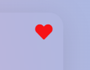
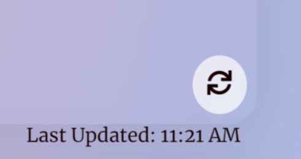
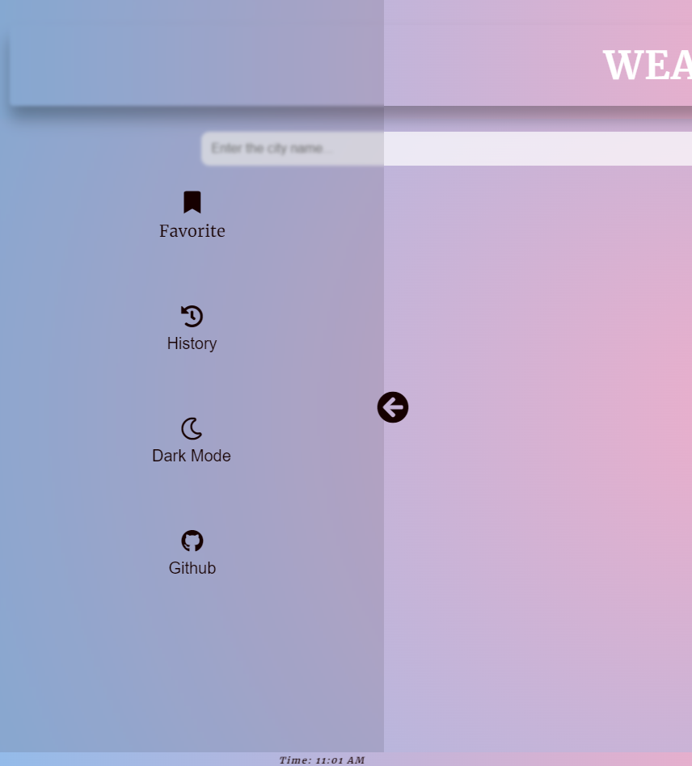
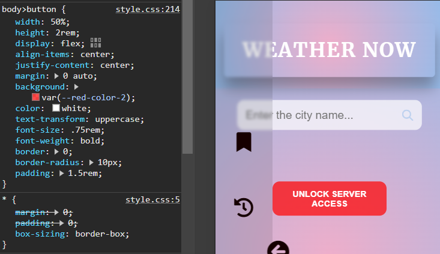

# [Weather Now](https://jeffdruid.github.io/weather-now/#/)

Weather Now is a web application that provides real-time weather information for any location worldwide.

## Table of Contents

<!-- TODO - Update table -->

1. [Introduction](#introduction)
2. [Technologies Used](#technologies-used)
3. [User Stories](#user-stories)
4. [Wireframe](#wireframe)
5. [Features](#features)

- [Animation Intro](#animation-intro)
- [Header](#header)
- [Weather Container](#weather-container)
  - [Buttons](#buttons)
- [Current Weather](#current-weather)
- [Search Functionality](#search-functionality)
- [Temperature Units](#temperature-units)
- [5-Day Forecast](#5-day-forecast)
- [Favorites](#favorites)
- [Dark Mode](#dark-mode)
- [Search History](#search-history)
- [Side Bar](#side-bar)
- [Chart](#chart)
- [GitHub](#github)
- [Loading Screen](#loading-screen)
- [Error Handling](#error-handling)
- [Alerts](#alerts)
- [Footer](#footer)

6. [Troubleshooting](#troubleshooting)

- [CORS Error](#cors-error)
- [API Key](#api-key)

7. [Testing](#testing)
   - [Validator Testing](#validator-testing)
     - [HTML](#html)
     - [CSS](#css)
     - [Javascript](#javascript)
   - [Accessibility](#accessibility)
   - [Lighthouse](#lighthouse)
   - [Responsiveness](#responsiveness)
   - [Manual Testing](#manual-testing)
     - [Cross-browser Compatibility](#cross-browser-compatibility)
     - [Responsiveness and Device Compatibility](#responsiveness-and-device-compatibility)
     - [Link Validation](#link-validation)
     - [Text and Font Readability](#text-and-font-readability)
     - [Acceptance Test](#acceptance-test)
     - [Desktop](#desktop)
     - [Tablet](#tablet)
     - [Mobile](#mobile)
8. [Bugs](#bugs)
   - [Fixed Bugs](#fixed-bugs)
9. [UI Improvements](#ui-improvements)
10. [Future Improvements](#future-improvements)
    - [Map Integration](#map-integration)
    - [Autocomplete](#autocomplete)
    - [User Interface](#user-interface)
    - [Cache Data](#cache-data)
11. [Deployment](#deployment)

- [Cloning & Forking](#cloning--forking)
- [Local Deployment](#local-deployment)
- [Remote Deployment](#remote-deployment)

12. [Credits](#credits)

- [Source Code](#source-code)
- [Icons](#icons)
- [Images](#images)
- [Useful links](#useful-links)

## Introduction

- Weather Now is an application that allows users to get the current weather and 5-day forecast for a specific location. The application provides information such as temperature, humidity, wind speed, sunrise, sunset, and weather description.

## Technologies Used

- HTML5
- CSS3
- Javascript
- OpenWeatherMap API
- Flags API
- Google Charts
- GSAP
- Python
- Flask
- Heroku
- Cors-Anywhere

## User Stories

| User Story                                                                                     | I Know I'm Done When...                                                                                                                                                                   |
| ---------------------------------------------------------------------------------------------- | ----------------------------------------------------------------------------------------------------------------------------------------------------------------------------------------- |
| As a user, I want to check the current weather for a specific city.                            | I can easily check the current weather for any city by entering the city name in the search box. The displayed information includes temperature, humidity, wind speed, and weather icons. |
| As a user, I want to view a 5-day weather forecast for a specific city.                        | I can explore a 5-day weather forecast for a selected city by clicking on the "Forecast" button. The application should display temperature and humidity trends for the specified city.   |
| As a user, I want to toggle between Celsius and Fahrenheit for temperature units.              | There is a temperature unit toggle button that allows me to switch between displaying temperatures in Celsius and Fahrenheit.                                                             |
| As a user, I want to view an interactive chart showing temperature and humidity trends.        | There is a "Chart" button that, when clicked, displays an interactive chart illustrating temperature and humidity trends for the 5-day forecast.                                          |
| As a user, I want to set a location as a favorite for quick access.                            | I can see a heart icon next to each location in the Weather App. Clicking the heart icon changes its color to red, indicating that the location has been set as a favorite.               |
| As a user, I want to view weather information for my favorite locations.                       | There is a "Favorites" button that, when clicked, displays weather information for all saved favorite locations.                                                                          |
| As a user, I want to toggle between light and dark mode for a personalized viewing experience. | There is a "Dark Mode" button that toggles between light and dark mode, providing a personalized viewing experience.                                                                      |
| As a user, I want to view my search history for quick reference.                               | There is a "Show History" button that, when clicked, displays a list of past searches for quick reference.                                                                                |
| As a user, I want to access the source code on GitHub.                                         | There is a GitHub icon or link that, when clicked, redirects me to the Weather App's source code on GitHub                                                                                |
| As a user, I want a visually appealing and responsive design.                                  | The application has a responsive layout that works well on different devices. The design is visually appealing, providing a seamless and enjoyable user experience.                       |

## Wireframe

<!-- TODO Update All alts -->

## Features

### Header

|                                                 |                                                 |
| ----------------------------------------------- | ----------------------------------------------- |
|  | Displays the header section of the application. |

### Animation Intro

|                                                      |                                                                                               |
| ---------------------------------------------------- | --------------------------------------------------------------------------------------------- |
|  | A quick animation intro using the GSAP library.                                               |
|         | The animation was made by FLIP for GSAP - [CodePen](https://codepen.io/GreenSock/pen/eYdyVVe) |

### Weather Container

|                                                               |                              |
| ------------------------------------------------------------- | ---------------------------- |
|  | Contains Weather information |

#### Buttons

|                                                          |                                                                                                                              |
| -------------------------------------------------------- | ---------------------------------------------------------------------------------------------------------------------------- |
|        | Add/Remove favorites                                                                                                         |
|         | Flags API provides flags icons.                                                                                              |
|  | Display when the weather was last updated.                                                                                   |
|      | Refresh weather information.                                                                                                 |
|   | Additional weather information, including a 5-day forecast and a forecast chart displaying temperatures and humidity levels. |

### Current Weather:

- Get real-time weather information such asn current temperature, feels-like temperature, maximum and minimum temperatures, sunrise, sunset, wind speed, humidity, and more.

|                                                                   |                                                                                                                                                                                |
| ----------------------------------------------------------------- | ------------------------------------------------------------------------------------------------------------------------------------------------------------------------------ |
|               | Upon loading, the application will ask user to allow location in order to get your current location and display the weather.                                                   |
|  | Error Message displayed when the user's location is not available. But the user can still access the services of the website, and the footer displays the user's current time. |

### Search Functionality:

|                                                  |                                                                                                           |
| ------------------------------------------------ | --------------------------------------------------------------------------------------------------------- |
|  | Allows user to enter a city name in the search box to retrieve weather details for any specific location. |

### Temperature Units:

|                                                         |                                                                                                                            |
| ------------------------------------------------------- | -------------------------------------------------------------------------------------------------------------------------- |
|  | Allows users to toggle between Celsius and Fahrenheit units to view temperature information according to their preference. |

### 5-Day Forecast:

|                                                       |                                                                                |
| ----------------------------------------------------- | ------------------------------------------------------------------------------ |
|  | Provides a 5-day weather forecast, displaying temperature and humidity trends. |

### Favorites:

|                                                                  |                                                                               |
| ---------------------------------------------------------------- | ----------------------------------------------------------------------------- |
|           | Allow users to save favorite locations and easily check the weather for them. |
|  |                                                                               |
|         | Clear all favorites from favorites container.                                 |

### Dark Mode:

|                                                                       |                                                                          |
| --------------------------------------------------------------------- | ------------------------------------------------------------------------ |
|               | Allow users to toggle between light and dark mode for better visibility. |
|  |                                                                          |

### Search History:

|                                                               |                                                                                 |
| ------------------------------------------------------------- | ------------------------------------------------------------------------------- |
|           | Allow users to view their search history to quickly revisit previous locations. |
|  |                                                                                 |

### Side Bar:

|                                                                |                                                                                                                 |
| -------------------------------------------------------------- | --------------------------------------------------------------------------------------------------------------- |
|          | The side bar contains additional options such as Favorites, Dark Mode toggle, Search History and a Github link. |
|  |                                                                                                                 |
|    |                                                                                                                 |

### Chart:

|                                                |                                                                                                                                                                                          |
| ---------------------------------------------- | ---------------------------------------------------------------------------------------------------------------------------------------------------------------------------------------- |
|  | Visualize temperature and humidity trends with an interactive chart. Clicking on the "Chart" button displays a graphical representation of temperature and humidity for the next 5 days. |

### GitHub:

|                                                    |                                                                      |
| -------------------------------------------------- | -------------------------------------------------------------------- |
|  | Allows users to explore and contribute to the source code on GitHub. |

### Loading Screen

|                                                                                                                                       |                                                                                          |
| ------------------------------------------------------------------------------------------------------------------------------------- | ---------------------------------------------------------------------------------------- |
|   | A loading spinner is displayed while the page loads content from the OpenWeatherMap API. |

### Error Handling

- Handles various error scenarios, including CORS issues, location access denial, and invalid or non-existent locations.

|                                                                             |                                                                                                                                    |
| --------------------------------------------------------------------------- | ---------------------------------------------------------------------------------------------------------------------------------- |
|                             | Error 429                                                                                                                          |
|           | Using Cors-Anywhere to provide cors access to the weatherKey flask app, where the API key is hidden.                               |
|   | Error message displayed when user has not allowed location, user still able to use the functions of this website after this error. |
|  | Error message displayed when localStorage does not have any favorites saved.                                                       |
|       | Error message displayed when localStorage does not have any previous searched locations                                            |
|        | Error message displayed when a location is invalid or does not exist.                                                              |

### Alerts

- Displays alerts for scenarios like attempting to refresh when already updated, trying to clear all favorites, and sending too many requests in a short amount of time.

|                                                                        |                                                                       |
| ---------------------------------------------------------------------- | --------------------------------------------------------------------- |
|      | If user refresher the page and the page is already up to date.        |
|  | Alert displayed when user tries to clear all favorites.               |
|  | If user has sent too many request requests in a short amount of time. |

### Footer

|                                         |                                                        |
| --------------------------------------- | ------------------------------------------------------ |
|  | The footer of the page displaying website information. |

## Troubleshooting

### CORS Error

- 

- During the development of the application, CORS (Cross-Origin Resource Sharing) issues were encountered when making requests from the frontend to the backend.

  - Addressing CORS issues during the development of this JavaScript project proved to be a valuable learning experience. The use of CORS-anywhere as a workaround provided a practical solution to enable smooth communication between the frontend and backend during the initial stages of development.

- Cors-Anywhere Proxy Solution

  - To overcome these CORS challenges, a workaround using the CORS-anywhere proxy was implemented. CORS-anywhere is a simple HTTP proxy that allows cross-origin requests to be made from the frontend, bypassing the usual CORS restrictions.
    

### API Key

- This Flask application serves as a secure backend solution for handling API requests to OpenWeatherMap. By keeping the API key on the server side, we mitigate the risk of exposing sensitive information to the client-side.

  - During the early stages of development, the OpenWeatherMap API key was inadvertently exposed in the GitHub repository. Recognizing the security implications of such a practice, a decision was made to find an alternative solution. Inspired by Dan Hamilton's App on GitHub, a small Flask application was implemented to serve as a backend.

- [WeatherKey - Source Code](https://github.com/jeffdruid/weatherKey)

### Remove User's Current Weather Information

- TODO
- Replaced the information with the most recent search, also avoiding sending to many API requests.

## Testing

- A series of testing was made by using different online validators such as JigSaw, W3C nd JSLint.

### Validator Testing

#### HTML

#### CSS

#### JavaScript

#### Accessibility

#### Lighthouse

### Responsiveness

### Manual Testing

- The manual testing conducted on the page includes the following aspects:

#### Cross-browser Compatibility

- Verified the functionality of the page across different web browsers to ensure it works properly and it is consistent.

#### Responsiveness and Device Compatibility

- Verified that the project displays correctly and functions appropriately across various device sizes, ensuring a good user experience.

#### Link Validation

- Verified all internal and external links to ensure they direct users to the intended destinations and open correctly without issues.

#### Text and Font Readability

- Verified that all text content and fonts used on the page are legible, clear, and easy to understand.

The manual testing confirms that the page operates smoothly across multiple browsers, adapts well to different devices, ensures accurate link navigation, and maintains clear readability for users interacting with the content.

#### Desktop

| Edge - Version 121.0.2277.98                            | Chrome - Version 121.0.6167.140                             | Firefox - Version 120.0.1                                     |
| ------------------------------------------------------- | ----------------------------------------------------------- | ------------------------------------------------------------- |
|  |  |  |

#### Tablet

| Edge - Version 120.0.2210.157                         | Chrome - Version 121.0.6167.101                           | Firefox - Version 122.0                                     |
| ----------------------------------------------------- | --------------------------------------------------------- | ----------------------------------------------------------- |
|  |  |  |

#### Mobile

| Edge - Version 120.0.2210.157                        | Chrome - Version 121.0.6167.143                           | Firefox - Version 122.0.1                                   |
| ---------------------------------------------------- | --------------------------------------------------------- | ----------------------------------------------------------- |
|  |  |  |

## Bugs

<!-- TODO -->

- Temperature not displaying the correct unit when toggle is activated.

### Fixed Bugs

|                                            |                                                           |
| ------------------------------------------ | --------------------------------------------------------- |
| Dark Mode not toggling properly on mobile. |  |

- Increased the `z-index: 9;` in order to display Side Bar Button on top of Side Bar.

|                                                       |                                                            |
| ----------------------------------------------------- | ---------------------------------------------------------- |
| Animation not in full screen after page is refreshed. |  |

- Set Header container and Main container to default `display: none`, and updated the their `display: flex` at the end of the animation.

  - Also default Main `height: 0;` and at the end of animation to `height: 100%`.

|                                                  |                                                                    |
| ------------------------------------------------ | ------------------------------------------------------------------ |
| Display CORS button only when status 403 occurs. |  |

- Moved the following code inside the getWeather function in order to check `if (response.status === 403)`.
  `unlockButton.addEventListener("click", function () {
  window.open("https://cors-anywhere.herokuapp.com/corsdemo", "_blank");
  unlockButton.style.display = "none";
});
document.body.appendChild(unlockButton);`

<!-- TODO -->

- Update current time in the footer to display location's current time instead of user's current time.

## UI Improvements

<!-- TODO -->

- Fix Padding on the Mobile screens for the CORS Button.
  
- Added the `padding:1.5rem;` to the CORS button for the mobile screens.
  

|                                          |                                                     |
| ---------------------------------------- | --------------------------------------------------- |
| Increase readability of footer elements. |  |

- Increased to `font-size: .75rem;`

|                                                 |                                                           |
| ----------------------------------------------- | --------------------------------------------------------- |
| Fix Header for better readability and contrast. |  |

- Added `text-shadow: 4px 4px 4px var(--primary-color);`

|                                                                                      |                                                                  |
| ------------------------------------------------------------------------------------ | ---------------------------------------------------------------- |
| Default Side Bar to open in order to fill white space when the page is first loaded. |  |

- Modify Side Bar to `display: none;` and after the animation intro `display:flex;`

|                                                           |                                                  |
| --------------------------------------------------------- | ------------------------------------------------ |
| Added padding to :hover elements in Favorites and History |  |

- Added `padding: 0.75rem` to both Favorites and History elements when hovered.

|                         |                                                        |
| ----------------------- | ------------------------------------------------------ |
| Shorter Animation intro |  |

- Reduced the delay from `gsap.delayedCall(curLayout === 0 ? 3.5 : 1.5, nextState);` to `gsap.delayedCall(curLayout === 0 ? 0.25 : 0.9, nextState);`

|                    |                                                                 |
| ------------------ | --------------------------------------------------------------- |
| Fix toggle buttons |  |

<!-- TODO -->

## Future Improvements

### Map Integration:

- Plan to add a map feature that shows the location of the city.

### Autocomplete:

- Implement autocomplete functionality for the search box.

### User Interface:

- Enhance the user interface with animations and updated weather icons.

### Cache Data

- TODO
- Use cache to store the weather data. (Future feature)

### Color code the temperature.

- TODO

## Deployment

### Cloning & Forking

#### Forking a Repository

1. Visit [Weather Now](https://github.com/jeffdruid/weather-now).
2. Click on the "Fork" button located in the top-right corner of the page.
3. Optionally, you can provide a description for your fork.
4. Select "Create fork". You will be redirected to your newly created forked repository.

#### Cloning a Repository

1. Navigate to the repository on Github and click the "Code" button located above the list of files.
2. Click on thee "Code" button and copy the repository's URL.
3. Open your Terminal application on your computer and change the directory to where you want the cloned directory.
4. Enter the command "git clone" followed by the repository's URL. This downloads a copy of the repository into your local machine.

### Local Deployment

1. Sign up for [Gitpod](https://www.gitpod.io/) using your GitHub account.
2. Install the Gitpod browser extension to access Gitpod from GitHub. You can find the extension [here](https://www.gitpod.io/docs/browser-extension/).
3. Go to the [Weather Now](https://github.com/jeffdruid/weather-now).
4. Click on the "GitPod" button above the list of files in the repository on GitHub. This opens Gitpod workspace using the repository.

### Remote Deployment

To deploy the site on Github Pages after forking or cloning:

1. Go to your repository on GitHub.
2. Click on the "Settings" tab on the top of your repository.
3. In the left sidebar, click on the "Pages" tab.
4. Under the "Build and Deployment" section, select "main" from the source drop-down list and click on the "Save" button.
5. The page will display the link to the deployed website. You wil see a green success message indicating that your site is published at the specific URL.

You can access the live link here : [Weather Now](https://jeffdruid.github.io/weather-now/#/)

## Credits

### Source code

<!-- TODO - Categorize -->

- [Open Weather Map](https://openweathermap.org/)
- [Google Charts](https://developers.google.com/chart)
- [Free Frontend](https://freefrontend.com/css-input-text/)
- [Yusuf önaldı](https://freedesignresources.net/34-weather-icon-pack/)
- [Glass Effect](https://webdesign.tutsplus.com/how-to-create-a-frosted-glass-effect-in-css--cms-32535t)
- [Font Awesome](https://fontawesome.com)
- [Search Icon inside input box](https://nikitahl.com/search-icon-inside-input)
- [How to Convert Celsius to Fahrenheit (°C to °F)](https://www.thoughtco.com/celcius-to-farenheit-formula-609227)
- [Convert temperatures to and from celsius, fahrenheit](https://www.w3resource.com/javascript-exercises/javascript-basic-exercise-11.php)
- [Openweather API, time always in my local time zone](https://stackoverflow.com/questions/60627245/openweather-api-time-always-in-my-local-time-zone)
- [localStorage](https://www.w3schools.com/jsref/prop_win_localstorage.asp)
- [HTML Web Storage API](https://www.w3schools.com/html/html5_webstorage.asp)
- [Country Flags](https://flagsapi.com/)
- [JavaScript Regular Expressions](https://www.w3schools.com/js/js_regexp.asp)
- [Marquee feature](https://codepen.io/notkieran/pen/jVmWNY)
- [Hide API key](https://jessicawatts-95014.medium.com/hiding-api-keys-js-656290a1132c)
- [Dave Gray - Hiding API Keys in Javascript Netlify](https://www.youtube.com/watch?v=2J3xbMkH2K4)
- [Handle CORS Client-side](https://gist.github.com/jesperorb/6ca596217c8dfba237744966c2b5ab1e)
- [Flip for GSAP](https://codepen.io/GreenSock/pen/eYdyVVe)
- [Placeholder - image from pngtree.com](https://pngtree.com/element/down?id=NjM5ODI2Ng==&type=1&time=1706706114&token=MTZmZDg0ZWMzNzQ0NDYwNWI5ZmE0MGRkMmNkOWZjZjk=&t=0)
- [Dan Hamilton](https://github.com/dlhamilton/weatherAPITest/blob/main/run.py)
- [Cors-Anywhere](https://github.com/Rob--W/cors-anywhere)
